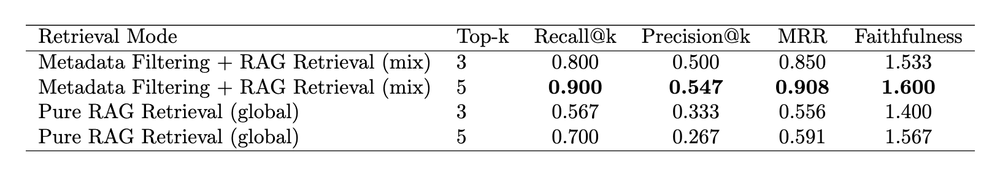
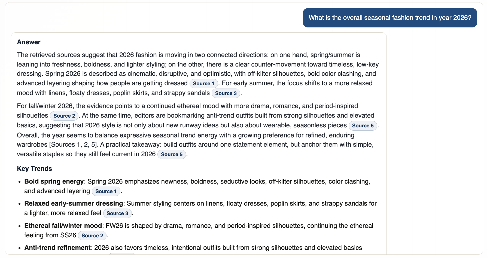
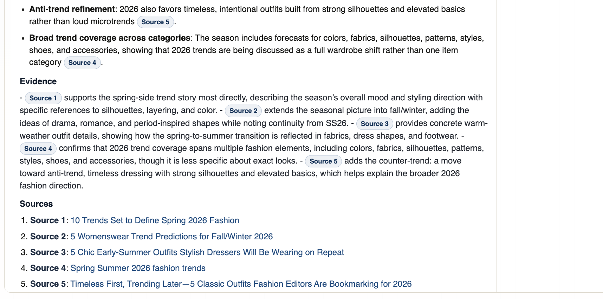
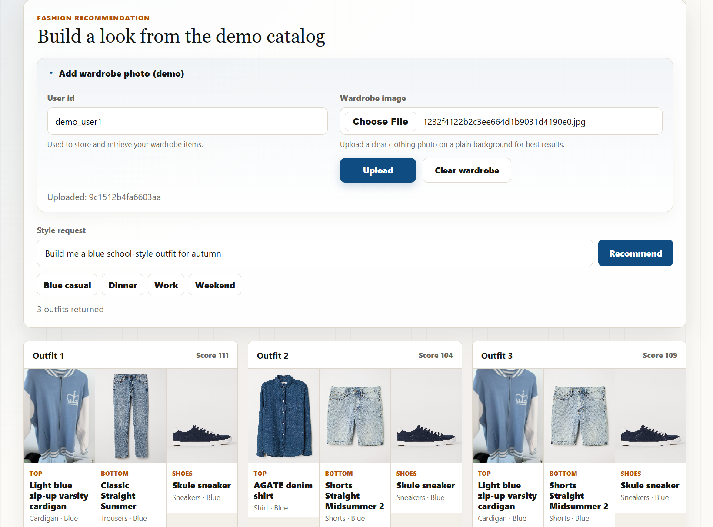
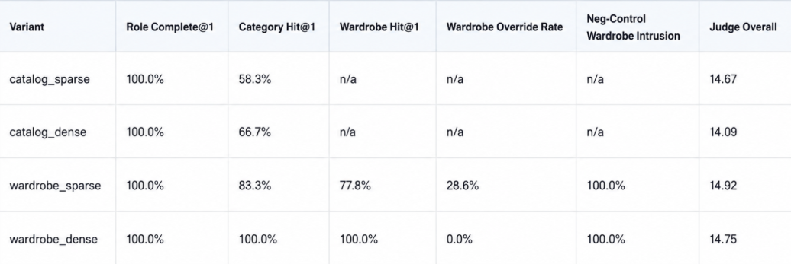

# Fashion_Bot

Fashion_Bot is a fashion assistant with two tracks:

1. **Track A - Fashion News QA (RAG):** answer fashion questions with retrieved evidence and citations.
2. **Track B - Outfit Recommendation:** generate outfit recommendations from catalog and optional wardrobe data.

## 0) Clone and enter project

Run:

```bash
git clone https://github.com/Zenpyhr/Fashion_Bot.git
cd Fashion_Bot
```


**The Track B recommender dataset is not fully included in this repository because it is too large for GitHub.**

Track B is built from the **H&M Personalized Fashion Recommendations** dataset:

[H&M Personalized Fashion Recommendations (Kaggle)](https://www.kaggle.com/competitions/h-and-m-personalized-fashion-recommendations)

For this repo, we use a smaller processed demo subset for local development. You can download that processed recommender data bundle here:

[Download processed recommender demo data from Google Drive](https://drive.google.com/file/d/1dfT4U9s_TT40qG8F76-ubQV0LO3tZi6y/view?usp=drive_link)

After downloading, place the directory under:

```text
Fashion_Bot/data/recommender/processed/
```

## 1) Working environment setup and dependencies

### Prerequisites

- Python `3.11+`
- `pip`
- (Optional) Docker, if you want Postgres/pgvector features

### Windows (PowerShell)

```powershell
py -3.11 -m venv .venv
.venv\Scripts\Activate.ps1
python -m pip install --upgrade pip
pip install -r requirements.txt
Copy-Item .env.example .env
```

### macOS / Linux (bash or zsh)

```bash
python -m venv .venv
source .venv/bin/activate
python -m pip install --upgrade pip
pip install -r requirements.txt
cp .env.example .env
```

If `python3.11` is not available on your machine, use `python3`.

Before running the API, scripts, or tests, activate the repo's `.venv`. If you are also using Conda, prefer the project virtual environment over the base Conda environment for this repo.

### Environment config

Edit `.env` and set at least:

- `OPENAI_API_KEY=...` (required for Track A answer generation and Track B LLM features)

Keep the defaults unless you intentionally want a different setup.

## 2) Run UI and API (quick start)

### Step 1: Optional DB startup (recommended for Track B dense/wardrobe features)

```bash
docker compose up -d
```

Docker is optional for QA and basic Track B sparse recommendations. It is required for Track B dense retrieval reranking and wardrobe embedding storage.

### Step 2: Build QA index (Track A)

If processed chunks already exist:

```bash
python scripts/qa_build_db.py
```

If you want to rebuild the QA corpus from local raw files:

```bash
python src/qa/scripts/process_for_rag.py
python scripts/qa_build_db.py
```

### Step 3: Run API server

```bash
python scripts/run_api.py
```

### Step 4: Open app

- UI: `http://127.0.0.1:8000/`
- Health: `http://127.0.0.1:8000/health`

### Step 5: Core API routes

- `POST /qa` with `{"question": "..."}`
- `POST /recommend` with `{"user_query": "...", "user_id": "demo_user"}`

## 3) Track A - Fashion News QA (RAG)

### Purpose

Answer fashion trend/styling questions using retrieved article evidence.

### Main responsibilities

- Scrape and collect fashion articles by scope.
- Clean and chunk article text.
- Build vector index with chunk embeddings.
- Retrieve relevant chunks and generate grounded answers.

### Deliverable

QA response containing:

- `answer`
- `citations`
- `sources`

### Key files

- `src/qa/scripts/web_scraping.py`
- `src/qa/scripts/process_for_rag.py`
- `src/qa/scripts/build_db.py`
- `src/qa/scripts/query_answer.py`
- `scripts/qa_build_db.py`
- `scripts/qa_answer.py`
- `app/routes/qa.py`
- `eval/qa_eval/evaluation_qa.py`

### File explanation

- `src/qa/scripts/web_scraping.py`: loads scoped URLs from `data/qa/url_list.json`, scrapes article text, removes boilerplate/paywall-like content, and saves raw `.txt` files with URL/scope/title headers.
- `src/qa/scripts/process_for_rag.py`: cleans raw article text, removes duplicates, performs sentence-aware chunking (target 150 words, 40 overlap), and writes `fashion_qa_articles_clean.jsonl` plus `fashion_qa_chunks.jsonl`.
- `src/qa/scripts/build_db.py`: reads chunk JSONL, generates normalized `all-MiniLM-L6-v2` embeddings, and upserts chunks + metadata into ChromaDB.
- `src/qa/scripts/query_answer.py`: runs retrieval (`mix` scoped+global or `global`), applies source-diversity selection, builds grounded prompt with citation rules, and generates the final answer.
- `scripts/qa_build_db.py`: convenience wrapper to run `build_db.py` from project root.
- `scripts/qa_answer.py`: CLI wrapper to run `qa_answer(question)` quickly.
- `app/routes/qa.py`: `/qa` API endpoint; validates input, retrieves context, generates answer, extracts citations, and returns structured sources.
- `eval/qa_eval/evaluation_qa.py`: evaluates QA with Recall@k, Precision@k, MRR, and faithfulness judge score.

### Typical commands

```bash
python scripts/qa_build_db.py
python scripts/qa_answer.py "What are overall seasonal fashion trends in year 2026?"
python eval/qa_eval/evaluation_qa.py
```

### QA Evaluation

We define 30 questions with ground truth fashion scope inside the `evaluation_qa.py` script. By running this script in the terminal, you will see the evaluation results:



Sample Answer:





## 4) Track B - Outfit Recommendation

### Purpose

Generate outfit recommendations from user intent plus catalog data (and optional wardrobe items).

### Current scope

- The current local demo catalog is a **5,000-item processed subset** for faster development and demos.
- The current default demo setup is **men-focused**; if the query does not specify a target group, the parser defaults to `men`.
- The recommender always tries to assemble a base outfit from `top + bottom + shoes`.
- `outerwear` is added when the query or weather cues imply layering, cold, or rain.

### Main responsibilities

- Parse user query into outfit constraints.
- Retrieve candidate items by role.
- Compose and rank outfits.
- Return explanations and missing-item hints.
- Optionally use dense retrieval and wardrobe embeddings.

### Deliverable

Recommendation response containing:

- `parsed_constraints`
- `outfits`
- `explanations`
- `missing_items`

### Dataset and demo subset

- Source dataset: **H&M Personalized Fashion Recommendations** on Kaggle.
- Raw recommender assets belong under `data/recommender/raw/hm/`, including `articles.csv` and the raw product images.
- The repo's default demo catalog is the processed `catalog_items_demo.csv` subset.
- The current demo summary contains **5,000 items** in `data/recommender/processed/catalog_items/catalog_items_demo_summary.json`.
- The subset/image bundle can be regenerated from the full catalog with `scripts/build_demo_image_subset.py`.
- The raw H&M files are only needed if you want to rebuild the processed catalog or regenerate the demo subset; they are not required just to run the shipped demo setup.

### Key files

- `src/recommender/outfits.py`
- `src/recommender/query_parser.py`
- `src/recommender/retrieval.py`
- `src/recommender/ranker.py`
- `src/recommender/normalize_catalog.py`
- `src/recommender/ingest_catalog.py`
- `src/recommender/wardrobe_service.py`
- `src/recommender/vlm_tagging.py`
- `app/routes/recommend.py`
- `app/routes/wardrobe.py`
- `scripts/test_recommender.py`
- `scripts/build_demo_image_subset.py`
- `scripts/build_catalog_embeddings.py`

### File explanation

- `src/recommender/outfits.py`: main pipeline orchestrator; parses request, retrieves candidates, composes outfits, reranks, and builds final recommendation output.
- `src/recommender/query_parser.py`: converts user text into structured constraints (occasion, formality, category/color hints, etc.) with deterministic rules and optional LLM refinement.
- `src/recommender/retrieval.py`: fetches candidate items per outfit role using metadata scoring, with optional dense rerank via embeddings/pgvector.
- `src/recommender/ranker.py`: deterministic ranking and diversity logic for selecting strong, non-duplicate outfit combinations.
- `src/recommender/normalize_catalog.py`: maps raw catalog attributes into canonical fields used by retrieval and ranking.
- `src/recommender/ingest_catalog.py`: loads and prepares catalog records for recommender modules.
- `src/recommender/wardrobe_service.py`: handles user wardrobe image storage, metadata persistence, and optional wardrobe embedding updates.
- `src/recommender/vlm_tagging.py`: tags wardrobe images with vision model output into catalog-like metadata schema.
- `app/routes/recommend.py`: `/recommend` API endpoint returning parsed constraints, outfits, explanations, and missing items.
- `app/routes/wardrobe.py`: wardrobe upload/clear endpoints for user-owned item flows.
- `scripts/build_demo_image_subset.py`: builds the smaller demo image/catalog subset from the full H&M catalog.
- `scripts/build_catalog_embeddings.py`: builds/refreshes catalog item embeddings in Postgres/pgvector for dense retrieval.
- `scripts/test_recommender.py`: local CLI smoke test for recommendation behavior and flags.

### Typical commands

```bash
python scripts/test_recommender.py
python scripts/run_api.py
```

`python scripts/build_catalog_embeddings.py` is only needed when you want to enable dense retrieval with `ENABLE_DENSE_RETRIEVAL_RERANK=true`.

### Frontend demo

Branch B frontend demo showing wardrobe upload, natural-language query input, and three generated outfit recommendations:



### Wardrobe flow

- Upload one image with `POST /wardrobe/upload` using `user_id` plus an image file.
- Clear a user's wardrobe state with `POST /wardrobe/clear`.
- Include the same `user_id` in `POST /recommend` so uploaded wardrobe items can be merged into the candidate pools.
- Wardrobe-assisted recommendations work best when Postgres/pgvector and embeddings are enabled, but the recommender still runs in catalog-only sparse mode without them.

### Example API request

```json
POST /recommend
{
  "user_query": "Build me a smart casual blue outfit for autumn",
  "user_id": "147"
}
```

Optional dense retrieval setup:

```bash
docker compose up -d
python scripts/build_catalog_embeddings.py
python scripts/check_catalog_embeddings_db.py
```

Then set `ENABLE_DENSE_RETRIEVAL_RERANK=true` in `.env`.

Dense retrieval reranks each role-based sparse shortlist using embeddings stored in Postgres/pgvector. Without that setup, the recommender still works using sparse metadata scoring only.

### Evaluation snapshot

Branch B evaluation summary across sparse/dense catalog retrieval and wardrobe-assisted variants:



### Troubleshooting

- If imports or dependencies appear to be missing, first activate `.venv` and rerun `pip install -r requirements.txt`.
- If Track B returns results but dense reranking or wardrobe-assisted retrieval is not working, confirm Docker is running and the embeddings setup steps were completed.

## 5) Data and folder map (quick reference)

```text
data/qa/
  raw_articles/
  processed_articles/
  index/
  url_list.json

data/recommender/
  raw/hm/articles.csv
  processed/catalog_items/
  user_wardrobe/

src/qa/scripts/
src/recommender/
app/routes/
```
